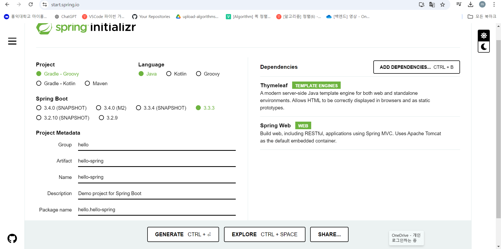

# Spring 스터디 week1 세션

작성일시: 2024년 9월 5일 오후 6:35
복습: No

## Java 17 및 IntelliJ(←얘는 일종의 IDE) 설치

**스프링부트 활용 - [https://start.spring.io](https://start.spring.io)**

**프로젝트 생성**



**intelliJ에서 열기**


**간단한 디렉토리 구성 정리**


main과 test로 구분. 오늘날 test 코드의 중요성을 보여줌. main/java와 main/resources의 차이는 간단히 말하자면 java 관련 코드는 java에, 그외 파일 및 자료들은 resources에..

**스프링부트 어플리케이션 실행**


**스프링 부트 라이브러리**

spring-boot-starter-web

- spring-webmvc: 스프링 웹 MVC
- spring-boot-starter-tomcat: 톰캣 (웹서버)

spring-boot-starter-thymeleaf: 타임리프 템플릿 엔진(View)
spring-boot-starter(공통): 스프링 부트 + 스프링 코어 + 로깅

- spring-boot
    - spring-core
- spring-boot-starter-logging
    - logback, slf4j
    

**테스트 라이브러리**

spring-boot-starter-test

- junit: 테스트 프레임워크
- mockito: 목 라이브러리
- assertj: 테스트 코드를 좀 더 편하게 작성하게 도와주는 라이브러리
- spring-test: 스프링 통합 테스트 지원

**웰컴 페이지 만들기 → index.html을 찾음**


**컨트롤러**


**템플릿**


**실행 화면**


**MVC 원리(model view controller)**


**빌드하고 실행하기**


웹 개발 3방식

1.  정적 컨텐츠 - 말그대로 파일 그대로를 유저에게 보여줌
2. MVC - 모델 생성, 템플릿 및 코드를 가공해서 제공
3. API - json형식 등으로 데이터를 내려주고 클라이언트 측에서 화면을 제공

**정적 컨텐츠**


MVC 및 템플릿 엔진(이 예시에서는 hello.html이라는 템플릿 파일 활용)


**MVC**

```java
@Controller
public class HelloController {
    @GetMapping("hello")
    public String hello(Model model){
        model.addAttribute("data", "hello!!");
        return "hello";
    }

    @GetMapping("hello-mvc")
    public String helloworld(@RequestParam("name") String name, Model model) {
        model.addAttribute("name", name);
        return "hello-template";
    }
}
```

```java
<html xmlns:th="http://www.thymeleaf.org">
<body>
<p th:text="'hello ' + ${name}">hello! empty</p>
</body>
</html>
```


**API**


