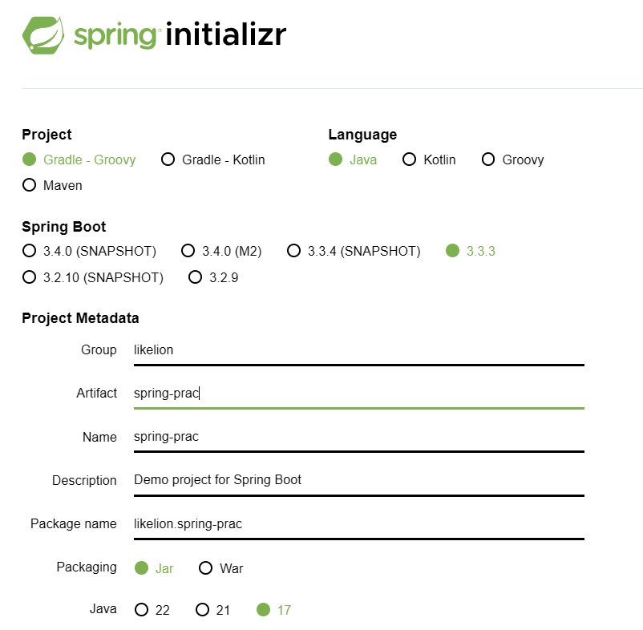
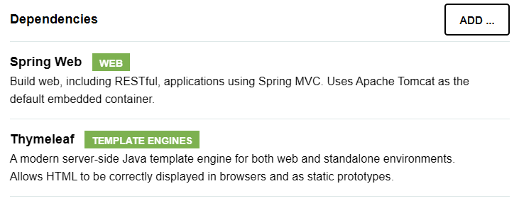
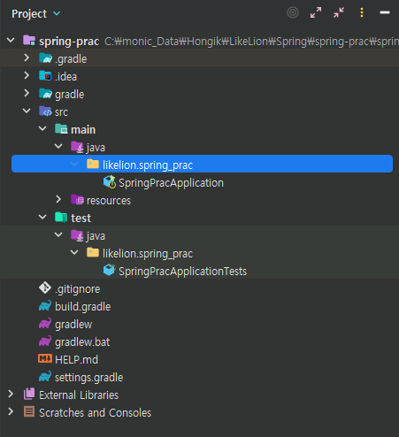
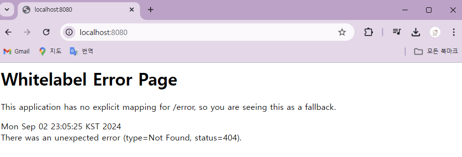
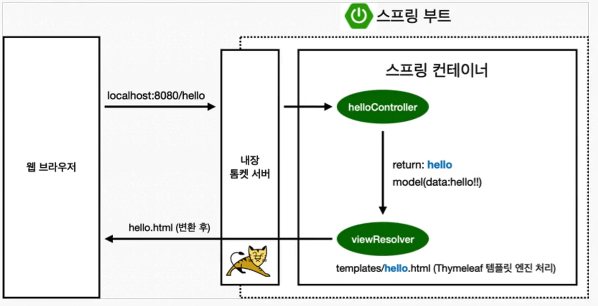
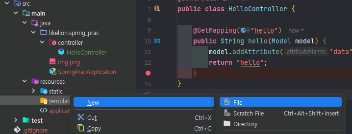
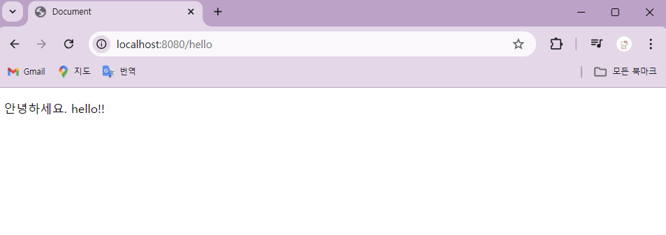

# 1. Project 생성

### 스프링 부트 스타터
  : 스프링 부트를 기반으로 스프링 프로젝트를 만들어주는 사이트
  
  [start.spring.io](https://start.spring.io/)


  * Spring initializer
    1. setting
    
        

    2. add dependencies

        

    3. generate
    4. 압축 해제

  * Open Project
    
    : Intellij에서 Open

      -> 압축 해제한 폴더에서 buid.gradle 선택
      
      -> open as project

### Project 실행
  * 프로젝트 기본 구조
  
      
    - src 

      : 기본적으로 main과 test 폴더로 구분 (<- 테스트 코드의 중요성)
    - resources

      : java 코드를 제외한 나머지 (ex) HTML 코드)
    - build.gradle

      : spring boot를 통해 제공 되는 설정 파일 (버전 설정, 라이브러리 등)


  * 프로젝트 실행

    : main 실행(run)

      -> 내장 된 톰캣(웹 서버)이 자체적으로 띄우면서 spring boot가 같이 올라옴

    => <http://localhost.8080> 접속
        

# 2. 라이브러리
: Gradle은 의존관계가 있는 라이브러리를 함께 다운로드 함
* 스프링 부트 라이브러리
  
  - spring-boot-starter-web
    - **톰캣** (웹서버)
    - 스프링 웹 **MVC**
  - 타임리프 템플릿 엔진(View)
  - spring-boot-starter (공통)
    - 스프링 부트
      - 스프링 코어
    - 로깅  
      - logback, slf4j
* 테스트 라이브러리
  - spring-boot-starter-test
    - junit : 테스트 프레임워크
    - mockito : 목 라이브러리
    - assertj : 테스트 코드 작성 도움
    - spring-test : 스프링 통합 테스트 지원


# 3. View 환경 설정

### Spring Boot Reference Doc.
 [Spring Boot Reference Documentation](https://docs.spring.io/spring-boot/docs/2.7.0/reference/htmlsingle/)

### welcome page 생성
  * static 내부에 index.html 생성

    : 정적인 페이지 생성

    => <http://localhost:8080> 접속하면 index.html 페이지 그대로 나옴

### Thymeleaf 템플릿 엔진
: 템플릿 엔진을 사용하여 편집 가능

  
    : Controller가 return 값으로 문자를 반환

  -> viewResolver가 화면을 찾아 처리 (스프링 부트 템플릿엔진 기본 viewName 매핑)

        ‘resources:templates/’ + (viewName) + ‘.html’
        
        (ex) templates/hello.html)


  - package 추가 (controller 추가)

    

    -> New Package

      

  - controller에 java class 추가

    

    ```
    package likelion.spring_prac.controller;
    import org.springframework.stereotype.Controller;
    import org.springframework.ui.Model;
    import org.springframework.web.bind.annotation.GetMapping;

    @Controller
    public class HelloController {

        @GetMapping("hello") // ~/hello 로 접근하면 해당 메서드를 호출
        public String hello(Model model) {
            model.addAttribute("data", "hello!!");
            return "hello";  // resources의 templates/hello.html 찾아서 렌더링
        }
    }
    ```
  - templates file 추가

    : hello.html 추가

    

    ```
    <!doctype html>
    <html>
    <head>
        <meta http-equiv="content-type" content="text/html; charset=UTF-8" />
        <title>Document</title>
    </head>
    <body>
    <p th:text="'안녕하세요. ' + ${data}" >안녕하세요. 손님</p>
    </body>
    </html>
    ```
    : ${data} 부분이 addAttribute 에서의 뒤의 인자로 치환 됨
    

  => <http://localhost:8080/hello> 접속
    


# 4. build, 실행
(bash 환경에서) 
### build
: 프로젝트 폴더 위치(gradle.bat 파일이 있는 위치)로 이동(`cd`) 

* build

  `./gradlew build`
* 이전 build 삭제하고 다시 build

  `./gradlew clean build`
* build 폴더 삭제

  `./gradlew clean`

### 실행
: build/libs로 이동(`cd`)

-> 실행
  
  `java -jar (프젝명)-0.0.1-SNAPSHOT.jar`

# +
: 프로젝트 open 시, build.gradle을 선택하여 open 권장