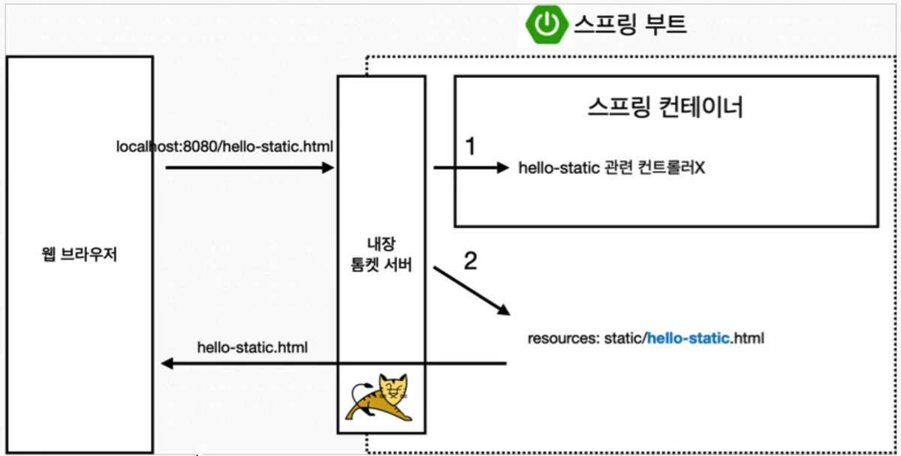
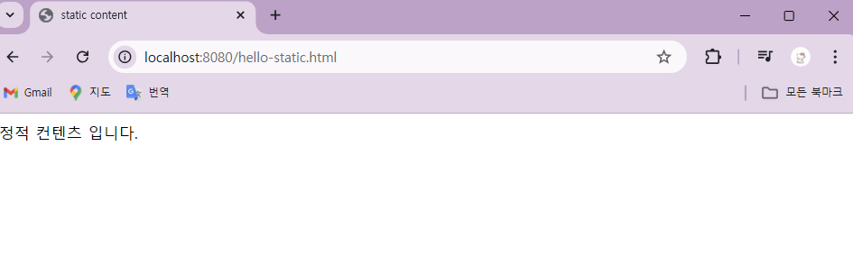
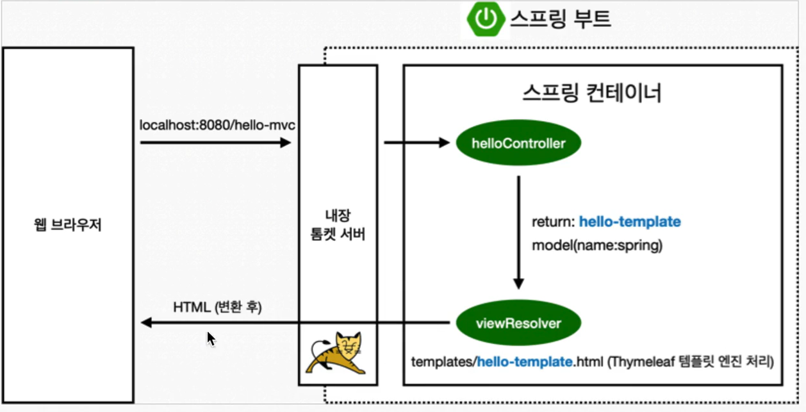
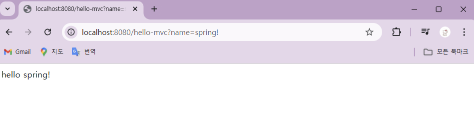
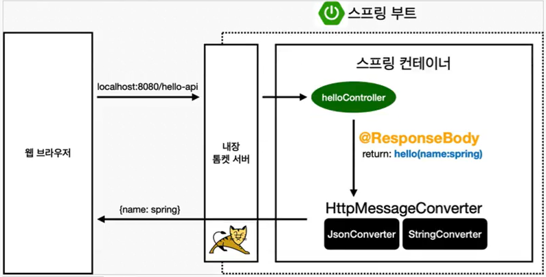
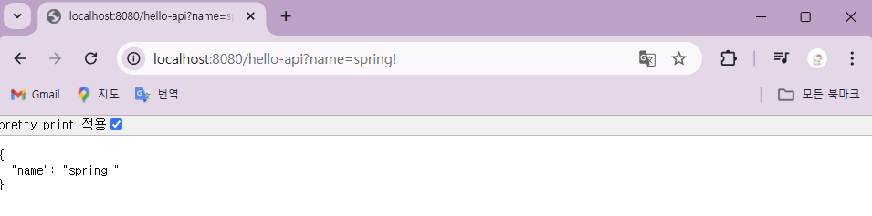

# 1. 정적 컨텐츠
: 파일을 그대로 클라이언트(웹 브라우저)에 전달해주는 방식

  1. 매핑 되는 컨트롤러가 없는 경우 
  2. 정적 컨텐츠를 탐색, 반환

### 정적 컨텐츠 방식 사용
  : resources/static 위치에 hello-static.html 추가

  => <http://localhost:8080/hello-static.html> 접속

  

# 2. MVC, 템플릿 엔진
: 서버에서 변형을 하여 클라이언트에전달해주는 방식




### MVC
  : Model, View, Contoller
  : controller와 view 역할 분리

  * Controller

    : 비즈니스 로직(내부적 처리)에 관련된 것에 집중
    ```
    @GetMapping("hello-mvc")
    public String helloMvc(RequestParam(value = "name") String name, Model model) {
        model.addAttribute("name", name);
        return "hello-template";
    }
    ```
    
  * View

    : 화면을 그리는 것에 집중

    -> templates/hello-template.html
    ```
    <html xmlns:th="http://www.thymeleaf.org">
    <body>
    <p th:text="'hello ' + ${name}" >hello! empty</p>
    </body>
    </html>
    ```

  => <http://localhost:8080/hello-mvc?name=spring!> 접속

  


# 3. API
: JSON 데이터 포맷으로 클라이언트에게 전달

  → view(템플릿)와 같은 것이 없고, 문자(return 값)가 그대로 넘어감

  

  * **@ResponseBody**  : HTTP의 BODY에 data를 직접 반환
  * **HttpMessageConverter** : viewResolver 대신에 동작
    * 문자 반환 → 기본 문자 처리 : StringConverter (StringHttpMessageConverter)
    * 객체 반환 → 기본 객체 처리 : JsonConverter (MappingJackson2HttpMessageConverter)
  
  ### StringConverter 사용 예시
  : 이해를 위한 예시

  * Controller

      (src/main/java/프로젝트/controller/HelloController)
      ```
      @GetMapping("hello-string")
      @ResponseBody 
      public String helloString(@RequestParam("name") String name) {
          return "hello " + name;
      }
      ```
    => <http://localhost:8080/hello-string?name=spring!> 접속하면 hello spring! 나옴


  ### JsonConverter 사용 예시
  : 실제 사용하는 방식 (data 넘기기)

  * Controller에 게터와 세터 생성

    : Getter and Setter 생성하기
    +) Generate 단축키 : Alt + Insert

    ```
    @GetMapping("hello-api")
    @ResponseBody
    public Hello helloApi(@RequestParam("name") String name) {
        Hello hello = new Hello(); // 객체 생성
        hello.setName(name);
        return hello;
    }

    static class Hello {
        private String name;

        public String getName() {
            return name;
        }

        public void setName(String name) {
            this.name = name;
        }
    }
    ```

    => <http://localhost:8080/hello-api?name=spring!> 접속
    
    