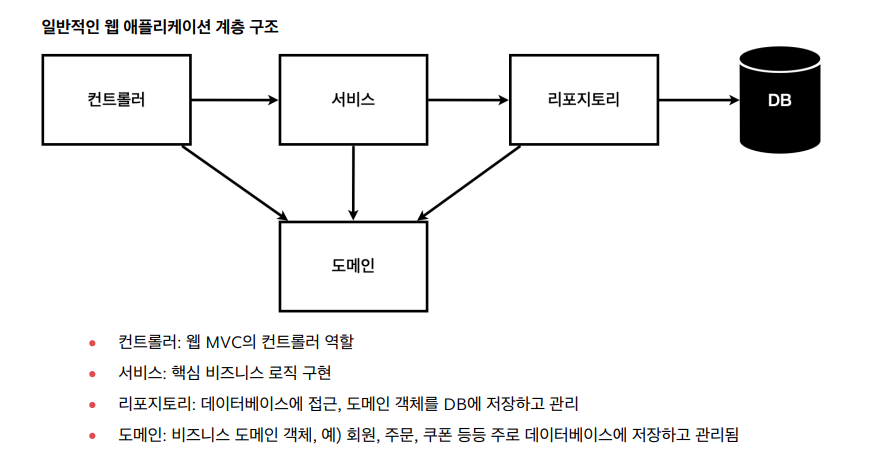

# Spring 스터디 week2 세션

작성일시: 2024년 9월 9일 오후 6:15
복습: No

**일반적인 웹 애플리케이션 계층 구조**



**회원도메인과 레포지토리(회원 정보 저장소) 만들기**


**회원 도메인 (Member 클래스) 작성**

```java
package mutsa.studyWeek2.domain;

public class Member {

    private Long id;
    private String name;

    public Long getId() {
        return id;
    }
    public void setId(Long id) {
        this.id = id;
    }
    public String getName() {
        return name;
    }
    public void setName(String name) {
        this.name = name;
    }
}
```

**레포지토리의 경우 - 인터페이스와 클래스 작성**

1. 인터페이스

    ```java
    package mutsa.studyWeek2.repository;
    
    import mutsa.studyWeek2.domain.Member;
    
    import java.util.List;
    import java.util.Optional;
    
    public interface MemberRepository {
        // 회원 저장
        Member save(Member member);
        // 회원 조회
        Optional<Member> findById(Long id);
        Optional<Member> findByName(String name);   // optinal은 null값의 경우 null을 반환하는 대신 optional로 반환
        List<Member> findAll();     // 지금까지 저장된 회원 리스트 전체 반환
    }
    ```

2. 클래스

    ```java
    package mutsa.studyWeek2.repository;
    
    import mutsa.studyWeek2.domain.Member;
    
    import java.util.*;
    
    public class MemoryMemberRepository implements MemberRepository{
    		
    		// 동시성 문제 우려
        private static Map<Long, Member> store = new HashMap<>();
        private static long sequence = 0L;
    
        @Override
        public Member save(Member member) {
            member.setId(++sequence);
            store.put(member.getId(), member);
            return member;
        }
    		
        @Override
        public Optional<Member> findById(Long id) {
            // null 값의 허용
            return Optional.ofNullable(store.get(id));
        }
    
        @Override
        public Optional<Member> findByName(String name) {
            return store.values().stream()
                    .filter(member -> member.getName().equals(name))
                    .findAny();     // 실행하다가 바로 찾으면 그대로 반환
        }
    
        @Override
        public List<Member> findAll() {
            return new ArrayList<>(store.values());     // store에 있는 values는 Member들
        }
    }
    
    ```


**DBMS를 선정하지도 않았고 구현한 것을 어떻게 확인?**

**→ 테스트 케이스를 활용 (Junit 프레임워크)**


**테스트 케이스 작성**

```java
package mutsa.studyWeek2.repository;

import mutsa.studyWeek2.domain.Member;
import org.junit.jupiter.api.Test;

import java.util.List;

import static org.assertj.core.api.Assertions.*;

class MemoryMemberRepositoryTest {
    MemberRepository repository = new MemoryMemberRepository();

    @Test
    public void save() {
        Member member = new Member();
        member.setName("deokyoung");

        repository.save(member);

        Member result = repository.findById(member.getId()).get();
        assertThat(member).isEqualTo(result);
    }

    @Test
    public void findByName() {
        Member member1 = new Member();
        member1.setName("강아지");
        repository.save(member1);

        Member member2 = new Member();
        member2.setName("고양이");
        repository.save(member2);

        Member result = repository.findByName("강아지").get();

        assertThat(result).isEqualTo(member1);
    }

    @Test
    public void findAll() {
        Member member1 = new Member();
        member1.setName("강아지");
        repository.save(member1);

        Member member2 = new Member();
        member2.setName("고양이");
        repository.save(member2);

        List<Member> result = repository.findAll();

        assertThat(result.size()).isEqualTo(2);
    }
}
```

**테스트 실행을 하면 findByName에서 error가 난다. 그 이유는 findAll에서 이미 “강아지”와 “고양이”를 set했는데 findByName에서 “강아지”와 “고양이”가 또 반복해서 set되고 있었기 때문이다.**

**해결방법) test가 끝날 때마다 레포지토리를 깔끔하게 지워주는 코드를 추가**

```java
인터페이스가 아닌 레포지토리에서 test 확인하기 위해
MemberRepository repository = new MemoryMemberRepository();
에서
MemoryMemberRepository repository = new MemoryMemberRepository();
로 변경
```

```java
MemoryMemberRepository 클래스에 아래 함수 추가
// 데이터 지우는 코드
public void clearStore() {
        store.clear();
}
```

```java
마지막으로 testcase에 clearStore() 함수를 실행시키는
일종의 콜백함수를 추가

@AfterEach
public void afterEach() {
    repository.clearStore();
}

이 함수는 각각의 Test가 끝날 때마다 실행되어 레포지토리에 저장되어 있는
데이터를 clear해줌
```

**<cf> 전공 지식**

**TDD : 테스트 주도 개발 - 위 경우와 달리 testcase를 먼저 작성하고 이후에 클래스를 만들고 구현 테스트**

## 회원 서비스 구현

- **회원가입 구현**


위 코드는 회원가입 시 동일한 이름의 멤버로 회원가입을 할 수 없게 검증하는 코드이다. 이렇게 코드를 입력하고 메서드 추출을 누르면


이렇게 깔끔하게 함수를 추출해준다. 보는 바와 같이 join(회원가입) 함수 내에 중복 회원 검증 함수를 호출하는 코드가 입력되었고 블록 외부에 검증 함수를 정의한 코드가 작성되었다.

- **회원 조회 구현**

```java
  	/**
     * 전체 회원 조회
     */
    public List<Member> findMembers() {
        return memberRepository.findAll();
    }

    /**
     * 특정 회원 조회
     */
    public Optional<Member> findOne(Long memberId) {
        return memberRepository.findById(memberId);
    }
```

구현한 코드 테스트하는 법 - 이때 testcase 간편하게 작성하는 법


클래스 이름에 커서를 대고 추가 액션을 누르면


이런 화면이 나오는데 테스트 생성을 누른다.

그럼 아래와 같은 틀의 테스트케이스가 생성된다.

```java
package mutsa.studyWeek2.service;

import org.junit.jupiter.api.Test;

import static org.junit.jupiter.api.Assertions.*;

class MemberServiceTest {

    @Test
    void join() {
    }

    @Test
    void findMembers() {
    }

    @Test
    void findOne() {
    }
}
```

유용한 점

```java
    테스트케이스는 현재 테스트하고자 하는 기능을 한글로 작성해도 된다.
    테스트 시 given(주어진 데이터), when(어떤 기능? 어떤 상황?을 테스트..)
    then(테스트 결과) 이렇게 3가지로 구분 지으면 테스트 작성이 편함
    
    @Test
    void 회원가입() {
        //given
        Member member = new Member();
        member.setName("deokyoung");

        //when
        Long saveId = memberService.join(member);

        //then
        Member findMember = memberService.findOne(saveId).get();
        assertThat(member.getName()).isEqualTo(findMember.getName());
    }
```

**MemberService와 MemberServiceTest가 같은 레포지토리를 가리키게 한다.**

```java
// MemberServiceTest
class MemberServiceTest {
    MemberService memberService;
    MemoryMemberRepository memberRepository;

    @BeforeEach
    public void beforeEach() {
        memberRepository = new MemoryMemberRepository();
        memberService = new MemberService(memberRepository);
    }
    ...
}

// MemberService
public class MemberService {
    private final MemberRepository memberRepository;

    public MemberService(MemberRepository memberRepository) {
        this.memberRepository = memberRepository;
    }
    ...
}
```

---

member 컨트롤러가 member sevice의 회원가입, 조회와 연결됨 → 의존관계

**연결 단계 → 스프링 빈 등록**

**스프링 빈을 등록하는 2가지 방법**

1. 컴포넌트 스캔과 자동 의존관계 설정
2. 자바 코드로 직접 스프링 빈 등록하기

**컴포넌트 스캔과 자동 의존관계 설정**

컨트롤러 설정 시 @Controller를 입력하는 것이 컴포넌트 스캔이다. `(@Component를 입력해도 됨)`

의존 관계는 아래 그림과 비슷해야 한다.


memberService와 memberRepository도 컴포넌트 스캔을 통해 빈 등록을 해야 하고, 자동 의존관계 설정을 위해 @Autowired를 추가한다.


**자바 코드로 직접 스프링 빈 등록**

```java
// SpringConfig 클래스를 작성

@Configuration
public class SpringConfig {

    @Bean
    public MemberService memberService() {
        return new MemberService(memberRepository());
    }

    @Bean
    public MemberRepository memberRepository() {
        return new MemoryMemberRepository();
    }
}
```

**※ 컴포넌트 스캔 vs 자바 코드를 활용한 직접 빈 등록 ※**

컴포넌트 스캔이 보기엔 편해 보이고 실제로 그리하여 많이 사용된다. 다만 @Autowired의 경우 클래스가 스프링 빈에 등록되어 있지 않으면 동작하지 않아 의존 관계가 끊어지고, 컴포넌트 스캔으로 빈을 등록한 경우 추후 실제 DB에 연결, 혹은 다른 DBMS로 넘어가야 할 경우에 코드의 수정이 많아져 불편하다.

직접 자바 코드로 스프링 빈을 등록하는 경우 귀찮고, 서비스가 많아질 경우 복잡할 수 있으나, DB로의 최종 연결 과정이 매우 간결하기 때문에 컴포넌트 스캔과 직접 설정 방법 중 자신의 실무 환경에 맞는 방식을 적절히 활용해야 한다.