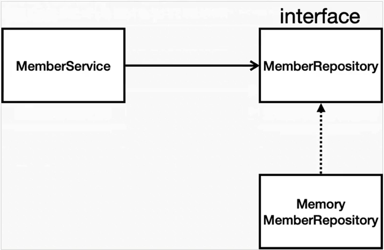

# 1. 비즈니스 요구사항 정리

### 일반적인 웹 어플리케이션 계층 구조
   
  - **컨트롤러** : 웹 MVC의 컨트롤러 역할
  - **서비스** : 핵심 비즈니스 로직 구현
  - **도메인** : 비즈니스 도메인 객체 - 주로 데이터베이스에 저장하고 관리 됨
  - **리포지토리** : 데이터베이스에 접근, 도메인 객체를 DB에 저장하고 관리

### 간단한 비즈니스 예제
  - 데이터 : 회원ID, 이름
  - 기능 : 회원 등록, 조회
  - 아직 데이터 저장소가 선정되지 않음 (가상의 시나리오)

  - 클래스 의존 관계
      
      : 아직 데이터 저장소가 선정 되지 않아서 일단은 메모리 기반 데이터 저장소 사용
        (메모리에 저장할 수 있도록!)
      
      → 나중에 데이터 저장소를 넣을 것이기 때문에 interface 필요
      
      ⇒ 인터페이스로 구현 클래스를 변경할 수 있도록 설계
       


# 2. 회원 도메인과 레포지토리 생성

### domain
  : 프로젝트에 domain 패키지 추가

  * Member class
    : domain에 Member 클래스 추가

    - 속성 추가
      ```java
      package likelion.spring_prac.domain;

      public class Member {

          private Long id;
          private String name;
      }
      ```

    - Getter, Setter 추가
  

### repository
: 프로젝트에 repository 패키지 추가

  * MemberRepository
    : Interface로 생성
    ```java
    package likelion.spring_prac.repository;

    import likelion.spring_prac.domain.Member;

    import java.util.List;
    import java.util.Optional;

    public interface MemberRepository {
        Member save(Member member);
        // Optional : Null인 경우를 대비
        Optional<Member> findById(Long id);
        Optional<Member> findByName(String name);
        List<Member> findAll(); // 저장된 모든 멤버 리스트 반환
    }
    ```

  * MemoryMemberRepository
    : Class로 생성

    - implement methods (Alt + Enter)
      
      -> 뜨는 옵션 전부 선택하여 OK

    ```java
    package likelion.spring_prac.repository;

    import likelion.spring_prac.domain.Member;

    import java.util.*;

    public class MemoryMemberRepository implements MemberRepository{

        // 저장할 곳이 필요
        private static Map<Long, Member> store = new HashMap<>();
        private static long sequence = 0L; // 키 값 생성
        
        @Override
        public Member save(Member member) {
            member.setId(++sequence);
            store.put(member.getId(), member);
            return member;
        }

        @Override
        public Optional<Member> findById(Long id) {
            // 단순히 store.get(id) 를 반환하지 않고 Optional로 감싸서 반환
            // -> Null인 경우에 클라이언트 측에서 조치 가능
            return Optional.ofNullable(store.get(id));
        }

        @Override
        public Optional<Member> findByName(String name) {
            return store.values().stream()
                    .filter(member -> member.getName().equals(name))
                    .findAny();
        }

        @Override
        public List<Member> findAll() {
            // store의 member들 반환
            return new ArrayList<>(store.values());
        }
    }
    ```

# 3. 테스트 케이스 작성
: 개발한 기능을 실행해서 테스트 할 때 자바의 main 메서드를 통해 실행하거나, 웹 어플리케이션의 컨트롤러를 통해서 해당 기능을 실행하면 준비하고 실행하는데 오래 걸리고, 반복 실행하기 어렵고, 여러 테스트를 한 번에 실행하기 어려움

→ JAVA : **JUnit** 이라는 프레임워크로 테스트 실행

* src/test/java/프로젝트 하위에 repository 생성
* 생성한 repository 하위에 테스트하려는 Test 생성

### MemoryMemberRepositoryTest
: MemoryMemberRepositoryTest 클래스 생성
  ```java
  package likelion.spring_prac.repository;

  import org.junit.jupiter.api.Test;

  // public 일 필요 없어서 public 없앰
  class MemoryMemberRepositoryTest {

      MemberRepository repository = new MemoryMemberRepository();

  }
  ```

  * save() 기능 확인
    ```java
    ...
    class MemoryMemberRepositoryTest {

        MemberRepository repository = new MemoryMemberRepository();

        @Test
        public void save() {

        }
    }
    ```
    -> save 함수 실행(run) 해보면서 확인

  * test 객체 생성 및 확인
    ```java
    @Test
    public void save() {
        // 새로운 객체 생성, 이름 설정
        Member member = new Member();
        member.setName("spring");

        repository.save(member);

        // optional -> get으로 꺼내와서 result라는 Member 객체에 받아 봄
        Member result = repository.findById(member.getId()).get();
    }
    ```
### 결과 확인
1. 직접 출력

    : 터미널에 직접 글자가 찍히지만 잘 사용하지 않음
    ```java
    @Test
    public void save() {
        Member member = new Member();
        member.setName("spring");
        repository.save(member);
        Member result = repository.findById(member.getId()).get();

        System.out.println("result = " + (result == member));
    }
    ```

2. Assertions

    : 직접 출력은 아니지만 성공 시 → Process finished with exit code 0 (초록 체크), 실패 시 → error 발생
  
    * Assertions.assertEquals
      ```java
      @Test
      public void save() {
          Member member = new Member();
          member.setName("spring");
          repository.save(member);
          Member result = repository.findById(member.getId()).get();

          Assertions.assertEquals(member, result);
      }
      ```
      +) 강제로 error 발생 시키는 코드 : `(Assertions.assertEquals(member, actual:null);`

    * Assertions.assertThat
      ```java
      @Test
      public void save() {
          Member member = new Member();
          member.setName("spring");
          repository.save(member);
          Member result = repository.findById(member.getId()).get();

          Assertions.assertThat(member).isEqualTo(result);
      }
      ```
      +) static으로 사용 : static import 추가(Alt + Enter)

        → import로 import static org.assertj.core.api.Assertions.assertThat;가 추가 되고, 형태가 단순하게 (assertThat) 변함

        => assertThat만 쳐서 사용 가능!

      +) 강제로 error 발생 시키는 코드 : `assertThat(member).isEqualTo(null);`

    +) 실무에서는 build 툴과 엮어서, testcase를 통과하지 못하면 넘어가지 않도록 설정

### 다른 기능 동작 test
* findByName() 
  ```java
  @Test
  public void findByName() {
      Member member1 = new Member();
      member1.setName("spring1");
      repository.save(member1);

      Member member2 = new Member();
      member2.setName("spring2");
      repository.save(member2);

      Member result = repository.findByName("spring1").get();
      
      assertThat(result).isEqualTo(member1);
  }
  ```

* findByAll()
  ```java
  @Test
  public void findAll() {
      Member member1 = new Member();
      member1.setName("spring1");
      repository.save(member1);

      Member member2 = new Member();
      member2.setName("spring2");
      repository.save(member2);

      List<Member> result = repository.findAll();

      assertThat(result.size()).isEqualTo(2);
  }
  ```

### AfterEach, clearStore
  * 전체 실행 : error 발생
    - 이유 : 순서 보장 x (test에 여러 함수가 있을 때 실행 순서 보장 x)
      -> 처음 실행하며 저장 된 객체가 다른 함수의 test에 쓰이면서 error 발생
      => 각 test가 끝날 때마다 객체를 지워 repository를 깨끗하게 유지해야함

    - 해결 : test 서로 의존 관계 없이 설계
      -> 하나의 test 가 끝날 때마다 저장소나 공용 data들을 깔끔하게 지워주기
  
  * MemoryMemberRepositoryTest 시작부 수정

    : MemoryMemberRepository 만 test 하는 것이라서 interface 말고 repository로 변경
    - 기존 : `MemberRepository repository = new MemoryMemberRepository();`
    - 수정 : `MemoryMemberRepository repository = new MemoryMemberRepository();`

  * main의 MemoryMemberRepository에 clearStore() 추가
    ```java
    public void clearStore() {
        store.clear();
    }
    ```

  * AfterEach 추가

    : test 가 실행 되고 끝날 때마다 repository를 한 번씩 지우도록
    ```java
    @AfterEach
    public void afterEach() {
        repository.clearStore();
    }
    ```
    

### test 방식
: 우리는 구현 클래스를 먼저 생성 -> test 작성

* cf. TDD (테스트 주도 개발)
    : test를 먼저 작성하고 main을 작성

# 4. 회원 서비스 개발 & 테스트
* 회원 서비스 Class : 회원 레포지토리와 도메인을 활용하여 실제 비즈니스 로직 작성
  
### Service
: src/main/java/프로젝트/service 패키지 생성

  * service에 MemberService 클래스 추가
  * repository 생성
    ```java
    package likelion.spring_prac.service;

    import likelion.spring_prac.domain.Member;
    import likelion.spring_prac.repository.MemberRepository;
    import likelion.spring_prac.repository.MemoryMemberRepository;

    public class MemberService {

        // repository 생성
        private final MemberRepository memberRepository = new MemoryMemberRepository();
    }
    ```
  * 회원 가입(join)
    ```
    ...
    public class MemberService {
        private final MemberRepository memberRepository = new MemoryMemberRepository();

        /**
        *  회원 가입
        */
        public Long join(Member member) {
        
        }
    }
    ```
    +) **Optional** 형태

      : `.get()` 으로 바로 꺼낼 수 있지만 권장하지는 않고, 위의 `.**ifPresent**()` 와 같은 메서드들을 사용하여 활용
      
      : get 대신 `.orElseGet()` 을 더 사용 - 값이 있으면 꺼내고, 없으면 method 실행 or default 값 넣어서 꺼내기 등의 동작

    - Optional 반환 명시해서 사용
      ```java
      public Long join(Member member) {
          // 로직 ex : 같은 이름의 중복 회원 불가
          // memberRepository.findByName(member.getName());
          Optional<Member> result = memberRepository.findByName(member.getName());
          result.ifPresent(m -> {
              throw new IllegalStateException("이미 존재하는 회원입니다.");
          });
              
          memberRepository.save(member);
          return member.getId();
      }
      ```

    - Optional 명시 사용 x
      ```java
      public Long join(Member member) {
          // 로직 ex : 같은 이름의 중복 회원 불가
          // Optional -> ifPresent로 로직 구현
          memberRepository.findByName(member.getName())
                  .ifPresent(m -> {
                      throw new IllegalStateException("이미 존재하는 회원입니다.");
                  });

          memberRepository.save(member);
          return member.getId();
      }
      ```
    
    - method로 추출

      : 하나의 기능 -> method로 추출하여 사용하기
        (Ctrl + Alt + Shift + T)
        

  * 회원 조회(find~)
    - 전체 회원 조회
      ```java
      public List<Member> findMembers() {
          return memberRepository.findAll();
      }
      ```

    - 한 회원 조회
      ```java
      public Optional<Member> findOne(Long memberId) {
          return memberRepository.findById(memberId);
      }
      ```


### Test
  * Test 간편하게 작성
    : Test를 만들고자하는 class에서 Ctrl + Shift + T
      -> Create New Test
      

  * service 정의
    ```java
    class MemberServiceTest {

        MemberService memberService = new MemberService();
    }
    ```

  * 함수 정의
    - given - when - then 패턴
      
      : 어떤 데이터를 기반으로 함 - 어떤 것을 검증 - 검증부
    
    - 회원가입
      ```java
      @Test
      void 회원가입() { // test code는 함수 이름이 심지어 한글이어도 괜찮음
          //given
          Member member = new Member();
          member.setName("hello");

          //when
          Long saveId = memberService.join(member);

          //then
          Member findMember = memberService.findOne(saveId).get();
          assertThat(member.getName()).isEqualTo(findMember.getName());

      }
      ```
      : 정상 flow test -> 예외 flow test가 더 중요하므로 중복 회원 예외 처리 필요

    - 중복 회원 예외
      ```java
      @Test
      public void 중복_회원_예외() {
          // given
          Member member1 = new Member();
          member1.setName("spring");

          Member member2 = new Member();
          member2.setName("spring");

          //when
          memberService.join(member1);

          try {
              memberService.join(member2);
              fail();
          } catch (IllegalStateException e) {
              // 예외가 터지는 상황에서 예외가 터짐 = 정상적 동작
              assertThat(e.getMessage()).isEqualTo("이미 존재하는 회원입니다.")
          }

          //then
      }
      ```
      `assertThat(e.getMessage()).isEqualTo("이미 존재하는 회원입니다.")`
      : 실제 main 함수의 예외 처리에서 “이미 존재하는 회원입니다.”가 나오도록 되어 있어서 그 text와 일치하는지 check

      -> 코드 개선 - assertThrows
        ```java
        @Test
        public void 중복_회원_예외() {
            // given
            Member member1 = new Member();
            member1.setName("spring");
            Member member2 = new Member();
            member2.setName("spring");

            //when
            memberService.join(member1);
            assertThrows(IllegalStateException.class, () -> memberService.join(member2));
            //then
        }
        ```
        +) assertThrows는 메세지가 반환이 되므로 다음과 같이 확인 가능하다
          ```
          memberService.join(member1);
          assertThrows(IllegalStateException.class, () -> memberService.join(member2));
          assertThat(e.getMessage()).isEqualTo("이미 존재하는 회원입니다.")
          ```

    - 매 테스트마다 clear
      : join을 반복하며 data가 쌓여 test가 제대로 되지 않으므로 clear 필요
      ```java
      class MemberServiceTest {

          MemberService memberService = new MemberService();
          MemoryMemberRepository memoryMemberRepository = new MemoryMemberRepository();
          
          @AfterEach
          public void afterEach() {
              memoryMemberRepository.clearStore();
          }
          ...
      }
      ```
      
      -> 그런데, MemberService에 이미 레포지터리 객체 생성이 존재함. 
     = 서로 다른 레포지터리 (서로 다른 인스턴스)

     (현재는 store 객체가 static으로 되어 있어 문제가 생기지 않지만, static이 아니면 다른 DB가 되며 문제 발생 (?))
     (+ 문제가 생기지 않더라도 같은 인스턴스로 구성하는 것이 맞음)

     => 객체 선언 수정 (DI)

  * DI (Dependenacy Injection)

    : 직접 new로 생성하지 않고, 외부에서 넣어줌

    - main의 MemberService 수정
      ```java
      ...
      public class MemberService {
          // repository 생성
          // 기존 : private final MemberRepository memberRepository = new MemoryMemberRepository();
          private final MemberRepository memberRepository;
          // repository 를 직접 생성하는 것이 아니라 외부에서 넣어주도록 바꿈
          public MemberService(MemberRepository memberRepository) {
              this.memberRepository = memberRepository;
          }
          ...
      }
      ```

    - test의 MemberServiceTest 수정
      ```java
      MemberService memberService;
      MemoryMemberRepository memberRepository;

      // 각 테스트를 실행하기 전에 만들고 넣어줌
      @BeforeEach
      public void beforeEach() {
          memberRepository = new MemoryMemberRepository();
          memberService = new MemberService(memberRepository);
      }
      ```
    
    => 같은 MemoryMemberRepository 가 사용 됨!