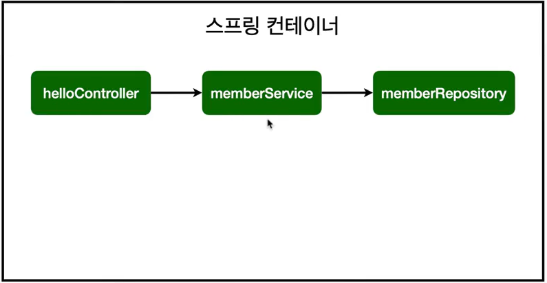
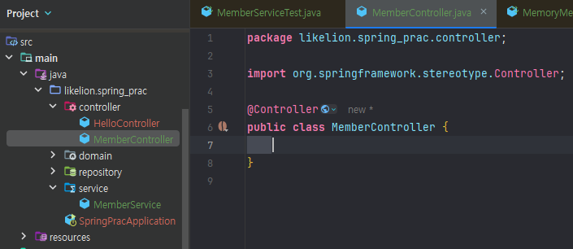
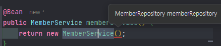

# 스프링 빈

### 정형화된 패턴
: **컨트롤러**(외부 요청 받기), **서비스**(비즈니스 로직), **리포지토리**(데이터 저장)

### 의존관계

- controller가 service에 의존 (의존관계가 있다)
    
  : controller가 service를 통해 로직을 거쳐 data가 저장 되고, data 조회를 할 수 있음
    
  
  : memberService 와 memberRepository 가 스프링 컨테이너에 스프링 빈으로 등록 됨
  
  : memberService는 memberRepository가 필요함

### 스프링 빈 등록
  : 스프링은 스프링 컨테이너에 스프링 빈을 등록할 때 기본적으로 싱글톤으로 등록 (유일하게 하나만 등록하여 공유)
  
  ⇒ 같은 스프링 빈이면 모두 같은 인스턴스

  +) helloControler는 스프링이 제공하는 컨트롤러여서 스프링 빈으로 자동 등록 됨

  * 스프링 빈 등록 방법
    1. **컴포넌트 스캔과 자동 의존관계 설정**
        - 컴포넌트 스캔 : @Controller, @Service, .. 등 명시
        - 자동 의존관계 : @Autowired
            
        +) @Autowired 는 스프링이 관리하는 객체에서만 동작 
            
          : 스프링 빈으로 등록하지 않고 내가 직접 생성한 객체에서는 동작 x 
            
        
    2. **자바 코드로 직접 스프링 빈 등록**
        
        : SpringConfig 파일에 빈에 등록할 것들 정의
        
    
    → 정형화된 컨트롤러, 서비스, 리포지토리 같은 코드는 컴포넌트 스캔 사용
    
    → 정형화되지 않거나, 상황에 따라 구현 클래스를 변경해야 하면 설정을 통해 빈 등록

         ex) DB 대신 MemoryMemberRepository를 사용하다가 나중에 DB로 리포지토리를 
               바꿀 것인데, 이런 경우 컨피그 파일을 변경하면 되므로 간편
    

- DI 주입 방법
    
    : 생성자 주입 사용 권장 - 의존관계가 실행중에 동적으로 변하지 않으므로
    
    - **생성자 주입**
        
        : 어플리케이션이 조립 되는 시점에 한 번 들어오고 끝
        
        ```java
        @Controller
        public class MemberController {
        
            private final MemberService memberService;
        
            // 생성자
            @Autowired
            public MemberController(MemberService memberService) {
                this.memberService = memberService;
            }
        }
        ```
        
    - 필드 주입
        
        ```java
        @Controller
        public class MemberController {
        
            @Autowired private final MemberService memberService;
        }
        ```
        
    - Setter 주입
        
        +) Generate : Alt + Insert → Getter and Setter 생성
        
        ```java
        @Controller
        public class MemberController {
        
        		private MemberService memberService;
        
            @Autowired
            public void setmemberService(MemberService memberService) {
                this.memberService = memberService;
            }
        }
        ```
        

# 1. 컴포넌트 스캔과 자동 의존관계 설정
: 회원 컨트롤러가 회원서비스와 회원 리포지토리를 사용할 수 있도록 의존관계 준비

* 컴포넌트 스캔과 자동 의존관계 설정
  - 컴포넌트 스캔 : @Controller, @Service, .. 등 명시
  - 자동 의존관계 : @Autowired
  
### Controller
: MemberController 생성
  * @Controller 어노테이션
    : 어노테이션이 붙은 class의 객체를 생성하여 spring 컨테이너에 넣어두고, sprig이 관리 = 컨테이너에서 Spring bin이 관리 됨
    
    -> MemberController 객체를 생성하여 관리


### 객체 공용으로 선언 : 컨테이너에 등록
**`private final** MemberService memberService = **new** MemberService();`

위처럼 new로 선언할 수 있지만, 
컨테이너에 등록을 하고 + 컨테이너에서 받아서 쓰도록 바꿔야 함

(다른 controller에서 MemberService를 가져다 쓰는 경우도 존재하므로)

* 생성자 위에 **@Autowired** 어노테이션
    
  : 스프링 컨테이너에 있는 객체 가져와서 연결 시켜 줌
      (스프링이 연관된 객체를 스프링 컨테이너에서 찾아서 넣어줌)
    
    = **DI** (Dependency Injection) : 의존성 주입
        : 객체 의존 관계를 외부에서 넣어주는 것
    
    ```java
    @Controller
    public class MemberController {
    
        private final MemberService memberService;
    
        // 생성자
        @Autowired
        public MemberController(MemberService memberService) {
            this.memberService = memberService;
        }
    }
    ```
    
    → 이것만으로는 오류 발생 : ‘memberService가 스프링 빈으로 등록되어 있지 x’
    
    (MemberService class가 순수 java 코드라 스프링이 알 수 없음)
    
    ⇒ **@Service** 어노테이션 추가
    
    : 스프링이 서비스를 인지 → 컨테이너에 등록 해 둠
    ```java
    @Service
    public class MemberService{
      ...
    }
    ```
    
    +) repository에는 @Repository 추가
    ```java
    @Repository
    public class MemoryMemberRepository{
      ...
    }
    ```
    
    = 정형화된 패턴 
        : 컨트롤러(외부 요청 받기), 서비스(비즈니스 로직), 리포지토리(데이터 저장)
    

- MemberService
    
    ```java
    @Service
    public class MemberService {
    
        private final MemberRepository memberRepository;
        
        **@Autowired**
        public MemberService(MemberRepository memberRepository) {
            this.memberRepository = memberRepository;
        }
        ...
    }
    ```
    
    : Service를 스프링 컨테이너에 등록하면서, MemberService 생성자 호출
    
    → @Autowired 가 존재 ⇒ repository가 필요하구나 → 스프링 컨테이너에 있는 memberRepository 넣어 줌


# 2. 자바 코드로 직접 스프링 빈 등록
:  @Service, @Repository, @Autowired 어노테이션 제거하고 진행

: 직접 설정 파일에 정의

### SpringConfig
: 프로젝트에 새로운 Class인 SpringConfig 생성

- **@Configuration**
    
    ```java
    package likelion.spring_prac;
    
    import likelion.spring_prac.service.MemberService;
    import org.springframework.context.annotation.Bean;
    import org.springframework.context.annotation.Configuration;
    
    @Configuration
    public class SpringConfig {
    
    }
    ```
    
* **@Bean**
    
  : 스프링 빈에 등록하라는 표시
    
    ```java
    package likelion.spring_prac;
    
    import likelion.spring_prac.service.MemberService;
    import org.springframework.context.annotation.Bean;
    import org.springframework.context.annotation.Configuration;
    
    @Configuration
    public class SpringConfig {
    
        @Bean
        public MemberService memberService() {
            return new MemberService();
        }    
    }
    ```
    
  → Ctrl + P 로 생성자에 넣어야 할 값 확인
    
    
    
    ⇒ MemberRepository 등록 필요
    
    ```java
    ...
    @Configuration
    public class SpringConfig {
    
        @Bean
        public MemberService memberService() {
            return new MemberService(memberRepository());
        }
    
        @Bean
        public MemberRepository memberRepository() {
            return new MemoryMemberRepository();
        }   
    }
    ```
    
    → 다음 그림의 구조가 완성 됨
      

      : memberService 와 memberRepository 가 스프링 컨테이너에 스프링 빈으로 등록 됨
      : memberService는 memberRepository가 필요함
    

+) Controller는 어쩔 수 없음 - **@Autowired** 사용

```java
@Controller
public class MemberController {

    private final MemberService memberService;

    // 생성자
    @Autowired
    public MemberController(MemberService memberService) {
        this.memberService = memberService;
    }
}
```