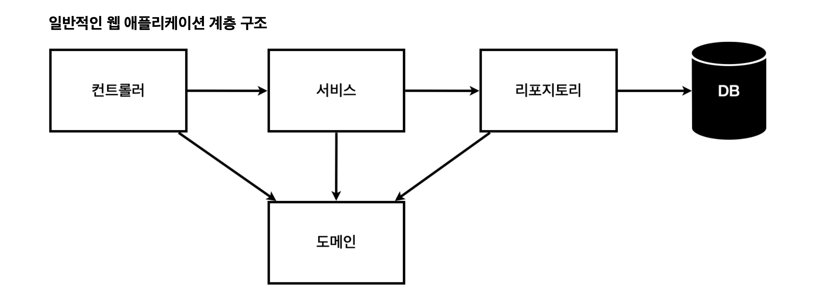

# Spring

# **🍃 스프링 부트 VS 스프링**

Spring과 Spring Boot는 모두 스프링 프레임워크를 기반으로 한 자바 웹 개발 프레임워크

- Spring은 스프링 프레임워크의 핵심 모듈을 모아서 만든 프레임워크
    
    Spring에서는 개발자가 직접 설정 파일을 작성하여 스프링 컨테이너를 구성하고, 필요한 빈 객체를 등록하고, 빈 객체 간의 의존성을 설정해야 함
    
- Spring Boot는 스프링 프레임워크를 보다 쉽게 사용할 수 있도록 만든 프레임워크
    
    개발자가 보다 쉽게 스프링을 사용할 수 있도록 설정과 의존성 처리 등을 자동으로 처리함
    
- 스프링(Spring)은 프레임워크이며, 스프링 부트(Spring Boot)는 스프링 프레임워크를 기반으로 한 도구
- 스프링은 설정 파일을 작성해야 하지만, 스프링 부트는 자동 설정을 제공하여 간편하게 개발할 수 있음. (또한, 스프링 부트는 내장 서버를 제공하여 쉽게 웹 애플리케이션을 실행할 수도 있음)
- Spring은 스프링 프레임워크를 보다 세밀하게 제어하고자 하는 경우에, Spring Boot는 빠르고 간단하게 스프링 애플리케이션을 개발하고자 하는 경우에 사용함

# **🍃 프로젝트 환경설정**

## 1️⃣ 프로젝트 생성

- java 17 설치 (JDK도 동일하게 17버전 설치)
- IntelliJ 설치
- 스프링 부트 스타터 사이트 이동해서 스프링 프로젝트 생성
    - https://start.spring.io/
    
    
    
    기본적인 dependencies인 Spring Web과 Thymeleaf도 같이 추가하여 생성한다.
    
    ```java
    plugins {
    	id 'java'
    	id 'org.springframework.boot' version '3.3.3'
    	id 'io.spring.dependency-management' version '1.1.6'
    }
    
    group = 'hello'
    version = '0.0.1-SNAPSHOT'
    
    java {
    	toolchain {
    		languageVersion = JavaLanguageVersion.of(17)
    	}
    }
    
    repositories {
    	mavenCentral()
    }
    
    dependencies {
    	implementation 'org.springframework.boot:spring-boot-starter-thymeleaf'
    	implementation 'org.springframework.boot:spring-boot-starter-web'
    	testImplementation 'org.springframework.boot:spring-boot-starter-test'
    	testRuntimeOnly 'org.junit.platform:junit-platform-launcher'
    }
    
    tasks.named('test') {
    	useJUnitPlatform()
    }
    
    ```
    

---

## 2️⃣ 프로젝트 라이브러리

- 프로젝트 폴더 내부가 main/test 폴더로 구분되어있음 ⇒ 테스트 코드가 중요함
- resources : 실제 자바 파일을 제외한 설정파일들
- build.gradle의 역할 : 버전 설정하고 라이브러리 당겨오는 역할
- 경로에 이모지 들어가면 안됨.. : Could not set process working directory to '/Users/leeyounjeong/Documents/🦁멋사🦁/java/Spring-Study/week1/yunjeong/hello-spring': could not setcwd() (errno 2: No such file or directory)

다음과 같은 로그가 뜬다면, [http://localhost:8080/](http://localhost:8080/) 에서 서버가 실행되고 있다!

`Tomcat started on port 8080 (http) with context path '/’` 


- Gradle은 의존관계가 있는 라이브러리를 함께 다운로드 하는 역할
    
     ex) spring-boot-starter-web 를 실행하려면 톰캣 라이브러리와 웹MVC 라이브러리가 필요
    
    ⇒ gradle이 spring-boot-starter-web를 다운로드할 때 필요한 라이브러리까지 다 다운로드 함
    


spring-boot-starter-web 라이브러리로 통해 스프링부트와 로깅 라이브러리 다 다운로드 받아짐

---

## 3️⃣ View 환경설정

```java
<!DOCTYPE HTML>
<html>
<head>
    <title>static content</title>
    <meta http-equiv="Content-Type" content="text/html; charset=UTF-8" />
</head>
<body>
정적 컨텐츠 입니다.
</body>
</html>
```


- 스프링 부트가 제공하는 WelcomePage 기능
    
    `resources/static/index.html` 을 만들면 루트 경로에 띄울 정적 페이지 완성
    
    ⇒ 먼저 정적에서 index.html 파일을 찾고 못찾으면 index 탬플릿 찾는 식으로 진행됨
    

더 자세한 내용은 [spring.io](http://spring.io)에들어가서 learn → spring 들어가서 문서 확인 https://docs.spring.io/spring-boot/index.html

---

## 4️⃣ thymeleaf 템플릿 엔진

- 화면을 `동적`으로 만들려면 템플릿 엔진을 사용해야 함.
미리 정의된 템플릿(Template)을 만들고, 동적으로 html 페이지를 만들어서 클라이언트에 전달하는 방식.
요청이 올 때마다 `서버에서 새로운 html 페이지를 만들어 주기 때문에 '서버 사이드 렌더링' 방식`이라고 함.
- 타임리프의 가장 큰 장점은 'natural templates'임.
    
    타임리프를 사용할 때 타임리프 문법을 포함하고 있는 html 파일을 서버 사이드 렌더링을 하지 않고 브라우저에 띄워도 정상적인 화면을 볼 수 있음. 타임리프의 확장자명은 .html 이며, 타임리프의 문법은 html 태그 안쪽에 속성으로 사용됨.
    
    ```java
    <html xmlns:th="http://www.thymeleaf.org">
    <body>
    <p th:text="'hello ' + ${name}">hello! empty</p>
    </body>
    </html>
    ```
    


**[동작 환경 그림]**


- spring boot는 내장된 톰켓 서버가 있음
- 톰켓 서버가 /hello를 보고 스프링 컨테이터에 물어봄
- return을 hello로 하면, resources/templete/에서 hello를 찾음 (viewResolver 역할)
- 그리고 resources/templete/에 있다면 동적 페이지를 thymeleaf 템플릿 엔진에서 처리함

---

## 5️⃣ 빌드하고 실행하기

./gradlew build

하고 build/libs 파일 들어가면 파일이 완성되어있음

java -jar 명령어로 실행

---

# **🍃 스프링 웹 개발 기초**

1. 정적 컨텐츠
    
    서버에서 하는 것 없이 그대로 웹 브라우저에 화면을 띄우는것
    
2. MVC와 템플릿엔진
    
    html을 그냥 주는게 아니라, 서버에서 동적으로 바꿔서 주는 것
    
    그걸 하기 위해서 컨트롤러, 모델, 템플릿엔진이 필요함
    
    정적 컨텐츠와 차이 : 정적 컨텐츠는 그대로 전달, 얘는 html을 좀 바꿔서 함
    
3. API
    
    Json이라는 데이터 포멧으로 클라이언트한테 데이터 전달
    
    서버끼리 통신할 때도 api 통신을 사용하기도 함
    

## 1️⃣ 정적 컨텐츠

스프링부트는 정적 컨텐츠를 기본으로 제공함

/static 폴더에서 찾아서 제공

ex) /static/hello-static.html으로 만들면

[localhost:8080/hello-static.html로](http://localhost:8080/hello-static.html로) 들어갔을 때 바로 보임


내장 톰켓에서 스프링부트에 보냄

컨테이너에 **관련 컨트롤러가 있는지 먼저 찾아봄 → 그다음 없으면 resource에서 관련 html이 있는 지 찾아봄**

---

## **2️⃣ MVC와 템플릿엔진**

MVC : model, view, controller

view → 화면을 그리는데, 집중해야함

model, controller → 내부 로직을 처리하는 데 집중해야함

```java
@Controller
 public class HelloController {
     @GetMapping("hello-mvc")
     public String helloMvc(@RequestParam("name") String name, Model model) {
         model.addAttribute("name", name);
         return "hello-template";
     }
}
```

```html
<html xmlns:th="http://www.thymeleaf.org">
 <body>
 <p th:text="'hello ' + ${name}">hello! empty</p>
 </body>
</html>
```

thymeleaf.org의 장점 → html을 그대로 쓰고 서버 없이 열어봐도 볼 수 있음
`<p th:text="'hello ' + ${name}">hello! empty</p>`

껍데기만 보는 경우 - > hello! empty가 뜸

---

## **3️⃣ API**

```java
 @GetMapping("hello-string")
    @ResponseBody
    public String helloString(@RequestParam("name") String name){
        return "hello " + name; //뷰 없이 이 문자 그대로 클라이언트에게 감
    }
```

- @ResponseBody 를 사용하면 뷰 리졸버를 사용하지 않음
- 대신에 HTTP의 BODY에 문자 내용을 직접 반환


→ 웹에 띄어진 코드를 봤을 때 html 화면이 가는게 아니라 return 문장이 그대로 출력된 것을 볼 수 있음


```java
@GetMapping("hello-api")
    @ResponseBody
    public Hello helloApi(@RequestParam("name") String name) {
        Hello hello = new Hello();
        hello.setName(name);
        return hello;
    }

    static class Hello {
        private String name;

        public String getName() {
            return name;
        }

        public void setName(String name) {
            this.name = name;
        }
    }
```

- getter, setter → 자바 빈 표준 방식
    - private는 외부에서 접근 못함
    - 접근할 수 있도록 getter, setter 사용


- `@ResponseBody` 를 사용
- HTTP의 BODY에 문자 내용을 직접 반환
- viewResolver 대신에 HttpMessageConverter 가 동작
- 기본 문자처리: `StringHttpMessageConverter`
- 기본 객체처리: `MappingJackson2HttpMessageConverter`

responsebody 있으면 http 응답에 그대로 넘기도록 동작함

근데 만약 객체를 준다면, json 형태로 데이터를 만들어서 http 응답에 반환함