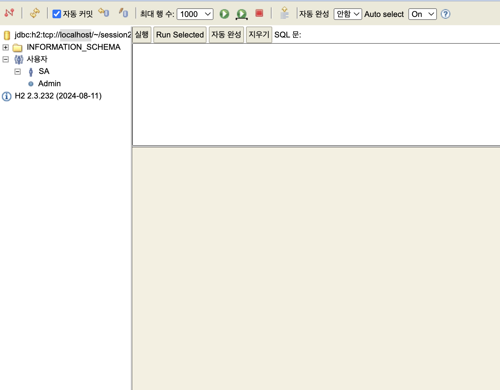

## 1️⃣ 진행과정에서 이해한 내용 정리

### ERROR : 데이터베이스 오류

```java
Expecting actual not to be null
java.lang.AssertionError: 
Expecting actual not to be null
	at session2.mutsa.service.MemberServiceTest.createMember(MemberServiceTest.java:42)
	at java.base/java.lang.reflect.Method.invoke(Method.java:568)
	at java.base/java.util.ArrayList.forEach(ArrayList.java:1511)
	at java.base/java.util.ArrayList.forEach(ArrayList.java:1511)

Java HotSpot(TM) 64-Bit Server VM warning: Sharing is only supported for boot loader classes because bootstrap classpath has been appended
2024-09-19T15:15:56.781+09:00  INFO 81537 --- [ionShutdownHook] j.LocalContainerEntityManagerFactoryBean : Closing JPA EntityManagerFactory for persistence unit 'default'
2024-09-19T15:15:56.783+09:00  INFO 81537 --- [ionShutdownHook] com.zaxxer.hikari.HikariDataSource       : HikariPool-1 - Shutdown initiated...
2024-09-19T15:15:56.784+09:00  INFO 81537 --- [ionShutdownHook] com.zaxxer.hikari.HikariDataSource       : HikariPool-1 - Shutdown completed.
> Task :test FAILED
MemberServiceTest > createMember() FAILED
    java.lang.AssertionError at MemberServiceTest.java:42
1 test completed, 1 failed
FAILURE: Build failed with an exception.
* What went wrong:
Execution failed for task ':test'.
> There were failing tests. See the report at: file:///Users/leeyounjeong/Documents/%EB%A9%8B%EC%82%AC/java/Session-practice/session2/build/reports/tests/test/index.html
* Try:
> Run with --scan to get full insights.
BUILD FAILED in 3s
4 actionable tasks: 2 executed, 2 up-to-date
```

h2를 키지 않고 실행해서 생긴 에러



> Task :test
BUILD SUCCESSFUL in 2s
4 actionable tasks: 2 executed, 2 up-to-date
오후 3:24:58: 실행이 완료되었습니다 ':test --tests "session2.mutsa.service.MemberServiceTest.createMember"'.
> 

h2를 실행한 상태로 코드를 돌리면 해결된다.

---

### 1. 스프링 DDD 설계

- 스프링은 DDD(Domain Driven Design : 도메인 주도 설계)를 따르고 있다.
- 도메인 패턴을 중심에 놓고 설계하는 패턴이며 도메인 간의 상호작용이 설계의 중심이 된다.
- **`Loose Coupling, High Cohesion`** 을 핵심 가치로, 모듈 간의 의존성은 최소화하고 응집성은 최대화 함으로써 **`핵심적인 기능은 모두 가지면서도 가벼운 설계를 만드는 것을 목적`** 으로 한다.
    
    (각 도메인의 역할이 분명하게 독립적이며 이는 다른 도메인과 연관되지 않음을 뜻함)
    
    DDD에서는 다음과 같은 4계층 구조를 따른다
    
     https://youwjune.tistory.com/38
    
    
    

1. **Presentation Layer(표현 계층) - Controller**
    - 사용자의 요청을 처리하는 Layer
    - Response를 보내는 역할을 하는 모든 클래스를 포함한다
    - Client로부터 request를 받고 response를 하는 모든 API를 포함한다
2. **Application Layer(응용 계층) - Service**
    - 비즈니스 로직을 정의하는 Layer
    - Domain Layer와 Infrastructure 계층을 연결
    - 실질적인 데이터 상태 관리와 처리는 Domain Layer에게 책임을 미루되,
        
        트랜잭션의 단위, DTO변환, 엔티티 조회 및 저장이 포함된다
        
    - error 검증도 여기 포함! + 요청 방식에 따라 달라지는 형식 검증도 여기 포함!
3. **Domain Layer(도메인 계층) - Model**
    - 비즈니스 규칙, 실직적인 도메인 정보를 가지고 있다.
    - Entitiy를 활용하여 도메인 로직이 실행된다
4. **Infrastructure Layer(인프라 계층) - Repository**
    - 외부와의 통신(DB, 메세징 시스템)을 담당한다.
    - 정보를 Application Layer나 Domain Layer에 전달

***Controller와 Service를 분리하는 이유**

**Controller에서는 사용자의 입력처리와 응답에만 집중하고, Service에서는 실제 기능을 어떤식으로 제공하는지에 대해서만 집중하기 위해서!**

---

### 2. 스프링 annotation

1. **member(doamin) annotation**
    
    ```java
    @Builder
    @Entity
    @NoArgsConstructor
    @AllArgsConstructor
    @Getter
    @EntityListeners(AuditingEntityListener.class)
    public class Member {
        @Id
        @GeneratedValue(strategy = GenerationType.IDENTITY)
        @Column(name="member_id")
        private Long id;
        private String name;
        private String email;
    
        @CreatedDate
        private LocalDateTime createdAt;
    }
    ```
    
    **<Lombok annotation>**
    
    `@Builder` : **빌더 패턴**을 자동으로 생성
    
    - 이름 함수로 각 값들이 세팅이 되어 가독성 좋음
    - 값 순서가 상관 없음
    
    `@NoArgsConstructor` : **모든 필드를 매개변수로 가지는 생성자**를 자동으로 생성
    
    - `@NoArgsConstructor` : 파라미터가 없는 디폴트 생성자를 생성
    - `@AllArgsConstructor` : 모든 필드 값을 파라미터로 받는 생성자를 생성
    - `@RequiredArgsConstructor` : final이나 @NonNull으로 선언된 필드만을 파라미터로 받는 생성자를 생성
    
    `@Getter` : 각 필드에 대한 **getter 메서드**를 자동으로 생성 ex) getName, getEmail
    
    **<JPA annotation>**
    
    `@Entity` : 데이터베이스의 테이블과 매핑되는 **엔티티**로 선언
    
    `@EntityListeners(AuditingEntityListener.class)` : 
    
    JPA Auditing : 자동으로 시간을 매핑하여 데이터베이스의 테이블에 넣어줌
    
    `@CreatedDate` - 엔티티가 처음 **저장될 때 생성 시각**을 자동으로 기록
    
    `@Id` : Primary key 의미
    
    **<그 외>**
    
    `@GeneratedValue(strategy = GenerationType.IDENTITY)` : 기본 키 값의 생성을 데이터베이스에 맡기는 방식으로, `GenerationType.IDENTITY` 는 자동증가 필드처럼 동작
    
2. **test annotaion**
    
    ```java
    @Transactional
    @Rollback //데이터 베이스 반영을 막는다
    ```
    
    `@Transactional` : 메서드나 클래스에 트랜잭션을 적용할 때 사용
    
    *트랜잭션이란? 
    
    여러 데이터베이스 작업을 하나의 작업 단위로 묶어서 처리하는 것
    
     중간에 오류가 발생하여 롤백하면 이 트랜잭션의 데이터베이스 작업이 모두 취소됨
    
    `@Rollback` : 테스트가 종료되면 변경 사항이 **자동으로 롤백 ⇒ 데이터베이스 저장 취소**
    
    *만약 flase로 하면 롤백되지 않고 데이터베이스에 반영됨
    

1. `@PathVariable` / `@RequestBody` / `@RequestParam`
    
    `@PathVariable` : URL 경로에 변수를 넣어 해당 값을 가져오는 데 사용
    
    ex) GET /members/1
    
    `@RequestBody` : 주로 `POST`, `PUT`, `PATCH` 메소드에서 사용되며, JSON 요청 데이터를 객체에 매핑하는 데 사용
    
    `@RequestParam` : 쿼리 파라미터나 폼 데이터로 전송된 값을 메소드 파라미터에 바인딩할 때 사용(쿼리 스트링 값 받아올 때) 
    
    ex) GET /members?email=yunjeong@gmail.com
    

---

### **3. JpaRepository**

- JpaRepository는 PagingAndSortingRepository, QueryByExampleExecutor 인터페이스를 상속받고 있다
- PagingAndSqortingRepository는 CrudRepository 인터페이스를 상속받고 있다.
- `CrudRepository` 인터페이스에는 기본적인 CRUD 메소드 제공한다.
    - ⇒ save(), findById(), existsById(), count(), deleteById(), delete(), deleteAll()
- `QueryByExampleExecutor` 인터페이스에는 더 다양한 CRUD 메소드 제공한다.
    - ⇒ findOne(), findAll(), count(), exists()
    

## 2️⃣ 포스트맨 화면 캡쳐

### ERROR : CreatedAt 에러


JPA Auditing을 사용하려면 Spring Boot 애플리케이션의 메인 클래스나 설정 클래스에 `@EnableJpaAuditing` 어노테이션을 추가해야 함

```java
@SpringBootApplication
@EnableJpaAuditing
public class MutsaApplication {

	public static void main(String[] args) {
		SpringApplication.run(MutsaApplication.class, args);
	}

}
```


`@EnableJpaAuditing` 을 추가하였더니 정상적으로 createAt이 출력됨

### 화면 캡쳐

POST /members


GET /members


GET /members/1


노션 링크 : https://2youn.notion.site/week3-105b1b16b9018096906ce3eba7c9f280?pvs=4
