# 프로젝트 생성
[start.spring.io](https://start.spring.io/)

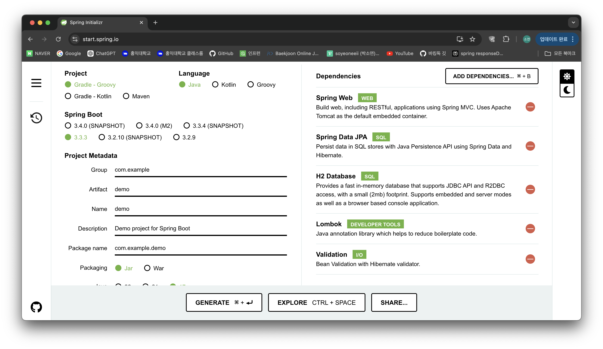

→ 인텔리제이 내부에서 바로 생성 가능 (하긴 한데 사이트 사용이 편했음)

# h2 디비 설치/연결
### h2 디비 설치
  [Downloads](https://www.h2database.com/html/download.html)

  h2 디비 설치

  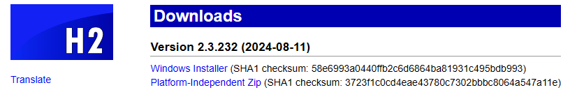

  → Zip 파일 다운로드

  h2 데이터베이스 설치 후 → 압축 풀고 → h2/bin 들어가기  (window : h2 bat 파일)

  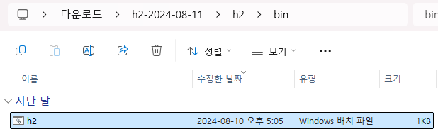

### 디비 연결
  * 만약 접속 URL이 IP주소로 되어 있다면 → localhost로 변경
  
    - 처음 : IP 주소로 되어 있음
    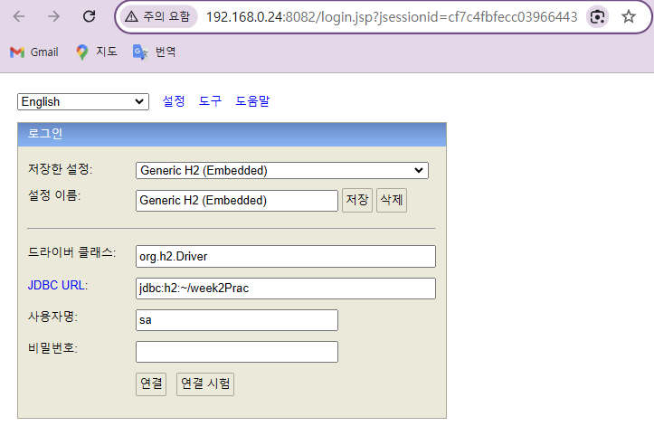
      
    - -> localhost로 변경
    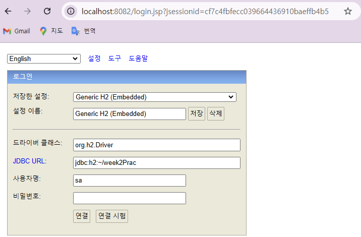
    
  * jdbc:h2:~/example 형태로 url 설정 (example 자리에는 자기가 원하는 이름으로)
  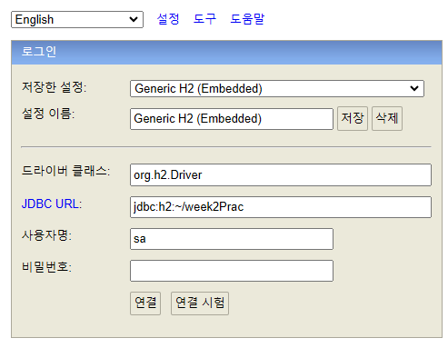
  
  * 로컬에 .mv.db 파일 생성 됨
  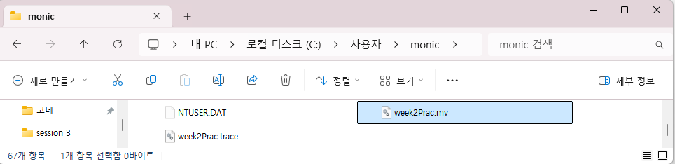

  * yml 파일 설정을 통해 프로젝트와 디비 연결 가능

    : 파일 설정 후 프로젝트 실행

    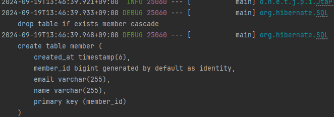
    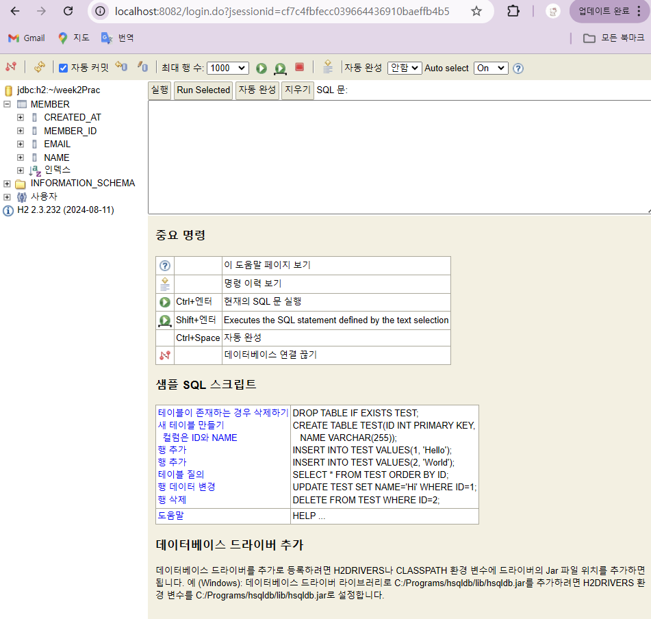


# 코드
### application.yml
  : resources 패키지 내부에 [application.properties](http://application.properties) 삭제 후 → application.yml 파일 생성

  ```java
  spring:
    datasource:
      url: jdbc:h2:tcp://localhost/~/week2Prac  //본인 h2 디비 url
      username: sa                              //기본 설정 값 그대로 두기
      password: //"00"                          //본인 설정 따라 : 없애도 됨
      driver-class-name: org.h2.Driver

    jpa:
      hibernate:
        ddl-auto: create
      properties:
        hibernate:
          format_sql: true

  logging:
    level:
      org.hibernate.SQL: debug
      org.hibernate.orm.jdbc.bind: trace
  ```

### domain/Member.java
  : 멤버로 id, name, email을 갖는 멤버 엔티티 정의

  ```java
  package likelion.week2Prac.domain;

  import jakarta.persistence.*;
  import lombok.AllArgsConstructor;
  import lombok.Builder;
  import lombok.Getter;
  import lombok.NoArgsConstructor;
  import org.springframework.data.annotation.CreatedDate;
  import org.springframework.data.jpa.domain.support.AuditingEntityListener;

  import java.time.LocalDateTime;

  @Entity    //entity 클래스임
  @Builder   //객체 생성 패턴 - 빌더 패턴 사용
  @NoArgsConstructor      // 파라미터가 없는 디폴트 생성자 자동 생성
  @AllArgsConstructor     // 모든 필드 값을 파라미터로 받는 생성자 자동 생성
  @Getter    // 멤버 필드의 getter 들 자동 생성 (이 경우 : getId, getName, getEmail)
  @EntityListeners(AuditingEntityListener.class)
  public class Member {
      @Id     // PK 명시
      @GeneratedValue(strategy = GenerationType.IDENTITY)   // 기본키 값 자동 생성
      @Column(name="member_id")       // 필드와 디비 컬럼 매핑
      
      private Long id;
      private String name;
      private String email;

      @CreatedDate
      private LocalDateTime createdAt;
  }
  ```

### controller/MemberController.java
  : 클라이언트로부터 request를 받고 response를 하는 모든 api 정의
  * **`@RequiredArgsConstructor`**
    
    : Lombok으로 스프링에서 DI(의존성 주입)의 방법 중에 
    생성자 주입을 임의의 코드 없이 자동으로 설정해주는 어노테이션
    (Lombok에서 @Getter, @Setter 어노테이션처럼 클래스에 선언된 final 변수들, 필드들을 매개변수로 하는 생성자를 자동으로 생성해주는 어노테이션)

    - 새로운 필드를 추가할 때 다시 생성자를 만들어서 관리해야하는 번거로움 x
    - 초기화 되지않은 final 필드나, @NonNull 이 붙은 필드에 대해 생성자를 생성
        
        = `@Autowired` 사용 없이 의존성 주입
        
        - @RequiredArgsConstructor 어노테이션 사용하지 않았을 때
            
            ```java
            @RestController
            @RequestMapping("/example")
            public class RequiredArgsConstructorControllerExample {
            
              private final FirstService firstService;
              private final SecondService secondService;
              private final ThirdService thirdService;
              
              @Autowired
              public RequiredArgsConstructorControllerExample(FirstService firstService, SecondService secondService, ThirdService thirdService) {
                this.firstRepository = firstRepository;
                this.secondRepository = secondRepository;
                this.thirdRepository = thirdRepository;
              }
            ```
            
        - @RequiredArgsConstructor 어노테이션 사용했을 때
            ```java
            @RestController
            @RequiredArgsConstructor
            @RequestMapping("/example")
            public class RequiredArgsConstructorControllerExample {

              private final FirstService firstService;
              private final SecondService secondService;
              private final ThirdService thirdService;
              
              ...
            }
            ```
  * `ResponseEntity<?>`
  
    : 반환 타입이 명확하지 않아도 return이 가능한데, (ex : `ResponseEntity<Object>`) 타입을 여러 개 받고 싶은 경우에 `Object` 대신 와일드카드(`?`)를 사용한다.
    
    [ResponseEntity의 사용법 및 유지보수](https://stir.tistory.com/343)

      

  ```java
  package likelion.week2Prac.controller;

  import likelion.week2Prac.domain.Member;
  import likelion.week2Prac.dto.MemberRequestDTO;
  import likelion.week2Prac.service.MemberService;
  import lombok.RequiredArgsConstructor;
  import org.springframework.http.ResponseEntity;
  import org.springframework.web.bind.annotation.*;

  import java.util.List;
  import java.util.Optional;

  @RestController                // restcontroller 임
  @RequiredArgsConstructor       // 생성자 의존성 주입 자동
  @RequestMapping("/members") // 공통 엔드포인트
  public class MemberController {

      private final MemberService memberService;

      // POST 요청 처리
      @PostMapping
      public ResponseEntity<?> createMember(@RequestBody MemberRequestDTO memberRequestDTO) {
          Member member = memberService.createMember(memberRequestDTO);
          return ResponseEntity.status(201).body(member);
      }

      // GET 요청 처리
      @GetMapping
      public ResponseEntity<?> getMemberList() {
          try{
              List<Member> response;
              response = memberService.getMemberList();
              if(response.isEmpty()){
                  return ResponseEntity.status(200).body("사용자가 존재하지 않습니다."); //200, 빈 리스트 반환
              }
              return ResponseEntity.ok(response);
          } catch (Exception e){
              return ResponseEntity.status(500).body("서버 내부 에러");
          }
      }

      @GetMapping("/{memberId}")
      public ResponseEntity<?> getOneMember(@PathVariable Long memberId) {
          try{
              Optional<Member> response = memberService.getOneMember(memberId);
              if (response.isPresent()) {
                  return ResponseEntity.ok(response.get());
              } else {
                  return ResponseEntity.status(404).body("해당 사용자를 찾을 수 없습니다.");
              }
          }catch (Exception e){
              return ResponseEntity.status(500).body("서버 내부 에러");
          }
      }
  }
  ```

### service/MemberService.java
  : 비지니스 로직 - controller가 요청받은 작업을 할 수 있는 메소드들 정의

  * **`@RequiredArgsConstructor`**

    :  `@Autowired` 사용 없이 의존성 주입

    - @RequiredArgsConstructor 어노테이션 사용하지 않았을 때
        
        ```java
        @Service
        public class MemberService {
          private final MemberRepository memberRepository;
          
          ...
          
          **@Autowired
          public MemberService(MemberRepository memberRepository){
            this.memberRepository = memberRepository;
          }**
        }
        ```
        
    - @RequiredArgsConstructor 어노테이션 사용했을 때
        
        ```java
        @Service
        @RequiredArgsConstructor
        public class MemberService {
          private final MemberRepository memberRepository;
          
          ...
          
        }
        ```
    

```java
package likelion.week2Prac.service;

import likelion.week2Prac.domain.Member;
import likelion.week2Prac.dto.MemberRequestDTO;
import likelion.week2Prac.repository.MemberRepository;
import lombok.RequiredArgsConstructor;
import org.springframework.stereotype.Service;

import java.util.List;
import java.util.Optional;

@Service                    // service 클래스임
@RequiredArgsConstructor    // 생성자 자동 생성
public class MemberService {

    private final MemberRepository memberRepository;

    public Member createMember(MemberRequestDTO memberRequestDTO){
        Member member = Member.builder()
                .name(memberRequestDTO.name())
                .email(memberRequestDTO.email())
                .build();

        Member savedMember = memberRepository.save(member);
        return savedMember;
    }
    public List<Member> getMemberList(){
        return memberRepository.findAll();
    }

    public Optional<Member> getOneMember(Long memberId){
        return memberRepository.findById(memberId);
    }
}
```


### repository/MemberRepository.java
  : DB와 통신

  : interface로 생성

  * JPA 활용

    : **JpaRepository**를 extends 하는 repository 클래스 생성

    ⇒ JPA 제공 기본 메서드 = 기본적인 CRUD 기능 제공 (→ 복잡한 쿼리문 사용 x)
                                                  (findAll(), findById(), save() 등)

    - **JPA** (Java Persistence Api) : 객체와 관계형 디비 사이에서 매핑 역할
    - **JpaRepository**  : Spring Data JPA에서 제공하는 인터페이스
        
        [JpaRepository (Spring Data JPA Parent 3.3.3 API)](https://docs.spring.io/spring-data/jpa/docs/current/api/org/springframework/data/jpa/repository/JpaRepository.html)
        

    + if) JPA를 활용하지 않고 jdbc (쿼리문 api)를 사용한다면?

    ```java
    // 1. 데이터베이스 연결
    Connection connection = DriverManager.getConnection("jdbc:mysql://localhost:3306/mydatabase", "username", "password");

    // 2. SQL 쿼리 작성 및 실행
    String sql = "SELECT * FROM users WHERE id = ?";
    PreparedStatement statement = connection.prepareStatement(sql);
    statement.setInt(1, 1);
    ResultSet resultSet = statement.executeQuery();

    // 3. 결과 처리
    while (resultSet.next()) {
        String name = resultSet.getString("name");
        System.out.println(name);
    }

    // 4. 연결 해제
    resultSet.close();
    statement.close();
    connection.close();
    ```

    ⇒ JPA 활용

    ```java
    public void printUserNameById(Long id) {
            User user = userRepository.findById(id).orElse(null);
            if (user != null) {
                System.out.println(user.getName());
            }
        }
    ```


  ```java
  package likelion.week2Prac.repository;

  import likelion.week2Prac.domain.Member;
  import org.springframework.data.jpa.repository.JpaRepository;
  import org.springframework.stereotype.Repository;

  @Repository     // repository 클래스임
  public interface MemberRepository extends JpaRepository<Member, Long> {
  }
  ```

### dto/MemberRequestDTO.java
  : (serializer와 비슷한 기능을 하는) Data Transmition Object

  * Record 문법을 사용하지 않은 DTO
    ```java
    package mutsa.second.demo.dto;

    import lombok.AllArgsConstructor;
    import lombok.Builder;
    import lombok.Data;
    import lombok.NoArgsConstructor;

    @Builder
    @NoArgsConstructor
    @AllArgsConstructor
    @Data   // getter, setter, toString, equals, hashCode, 기본 생성자까지 자동으로 생성
    public class example {
        private String name;
        private String email;
    }
    ```
  
  ```java
  package likelion.week2Prac.dto;

  public record MemberRequestDTO(String name, String email) {
  }
  ```

# 포스트맨
### POST
: localhost:8080/members

  * createdAt이 null로 들어가는 오류 발견

    => **@EnableJpaAuditing**

      : domain에서 createdAt을 위한 어노테이션 중 `@EntityListeners(AuditingEntityListener.class)` 가 있었는데, 이것은 Auditing을 사용하겠다는 코드이고, 이를 활성화하기 위한 코드(`@EnableJpaAuditing`)를 application.java 파일에 추가해줘야 함
  
  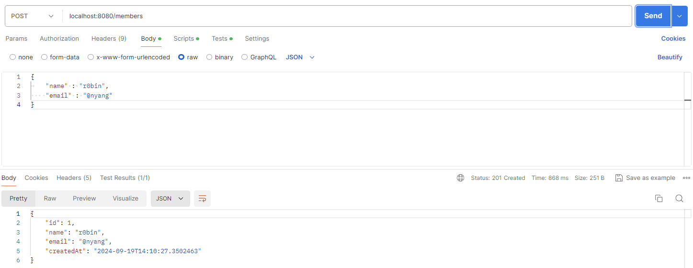
  

### GET
  * localhost:8080/members
    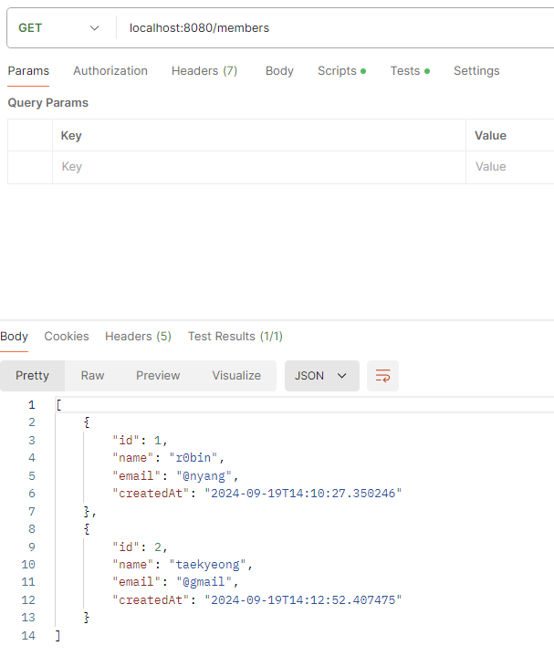
  * localhost:8080/members/{id}
    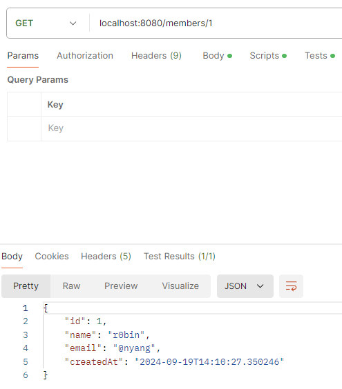
    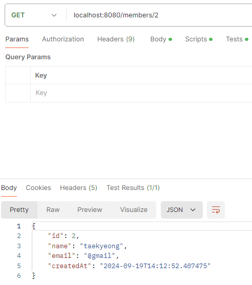

### DB 확인
  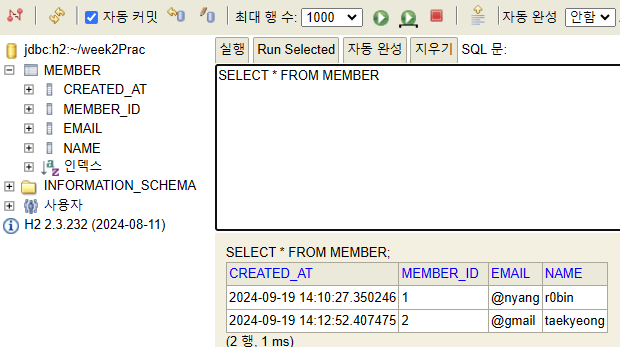